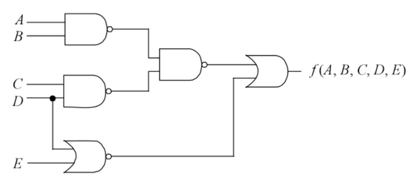

# 2020-1 AV1 Simulado

- USAR O LINUX!

Simulado da avaliação 1 de Elementos. 

```diff
+ Versào simplificada!
```

- **Trabalhar sozinho**
- **10 minutos**

## Começando

Você deve:

1. realizar um fork desse repositório  
1. clonar o seu fork (e trabalhar nele)
1. editar o arquivo `ALUNO.json`
1. não esqueça de dar `commit` e `push`

Todas as questões possuem testes. Vocês devem editar o arquivo `tests/config.txt` para inserir o módulo no teste. A simulação e o teste deve ser executada pelo comando `./testeAVI.py`

# Questões

Esse simulado possui um total de duas questões.

**LEMBRE DE REALIZAR COMMIT A CADA QUESTÃO E PUSH AO FINALIZAR**

### 1 

| Arquivo                |
| -------                |
| `src/rtl/questao1.vhd` |

O circuito elétrico a seguir:



Possui a seguinte equação lógica:

```
            _   _
A.B + C.D + D . E
```

1. Implemente em VHDL a equação e teste.
1. Gerer o RTL do circuito e salve na pasta do repositório com o nome `questao1.png`

> Não esqueça de realizar commit!

### 2 (6HW)

| Arquivo                | pts  |
| -------                | ---- |
| `src/rtl/questao2.vhd` | 6 HW |

Você deve implementar o circuito a seguir em vhdl:


> Não esqueça de realizar commit!
> Não esqueça de realizar push!


